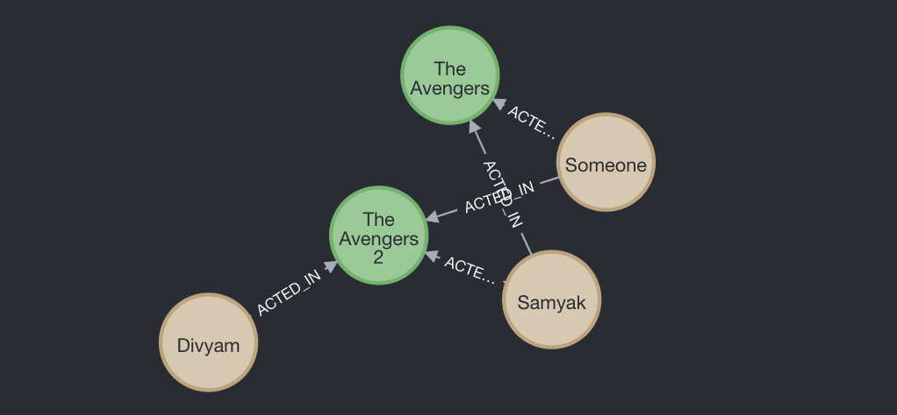

# Getting Started 
To get the project locally on your computer : 
* clone the repo: https://github.com/divyam-p/MoviesAndActorsNeo4JAPIClone
* open with some IDE  
  * for Eclipse : 
    * go to File -> Import -> Maven -> Existing Maven Projects and open at location of project 
    * Right click the project -> Maven Build.. and input "compile exec:java" in the goals input box 
    * apply and close and then run App.java, the server should have started on port 8080 to which API calls can be made 
    * A neo4J database also needs to be running with password "1234" on "bolt://localhost:7687" 

# Built With 
* Java 
* Neo4J

# Description 
>> This is a Java REST API project using Neo4J. 
* The Neo4J database is used to store actors and movies. 
* Some possible API calls include adding an Actor, adding a Movie, adding a relationship between an Actor and a Movie, getting a movie or actor, computing the "bacon number" and "bacon path" which is the shortest path between an actor given and an actor named "Kevin Bacon" (assuming Kevin Bacon is in the database and has a relationship with the given actor in some way) 
* Note: Specifications to the different API calls can be better understood by looking at the API calls in the Neo4jDatabase.java file inside src folder 

# Project Images 

    
 
# Acknowledgements 
Made By: 
* Divyam Patel 
* Samyak Mehta
